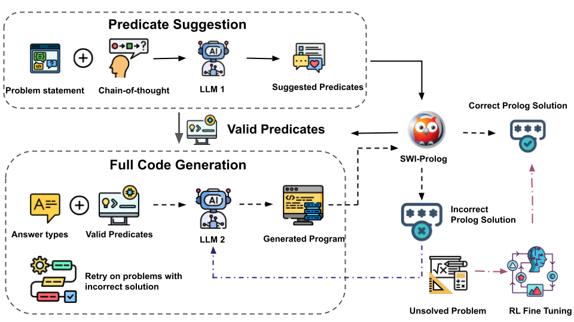

# Predicate-Guided Generation for Mathematical Reasoning

> **Paper:** [Predicate-Guided Generation for Mathematical Reasoning (EMNLP 2025 Main)](https://aclanthology.org/2025.emnlp-main.462/)  
> **Authors:** Jiajun Chen & Yik-Cheung Tam, NYU Shanghai  
> **Dataset:** [Hugging Face – Tinyhope/Prolog-MATH](https://huggingface.co/datasets/Tinyhope/Prolog-MATH)

---

## Overview
We introduce an automated data generation framework that enables large language models to learn symbolic and compositional mathematical reasoning beyond numeric answer prediction.
Our predicate-guided two-stage pipeline automatically constructs verifiable training data by first predicting reusable predicate abstractions (e.g., coprime/2, square/1), and then generating full Prolog programs that can be executed and checked for correctness.
By further optimizing models with Group Relative Policy Optimization (GRPO) and a predicate-aware reward, the method achieves strong generalization across symbolic forms—equations, sets, and proofs—while maintaining logical consistency and interpretability.
This approach establishes a scalable and verifiable paradigm for automated symbolic data generation and generalizable reasoning in LLMs.

  

**Key ideas:**
1. **Two-stage pipeline** – first suggest reusable mathematical predicates, then generate full Prolog solutions.
2. **Predicate-aware reward** – evaluates both correctness and structural quality of Prolog programs. Use finetuned model to further boost coverage. 

---

> ** Note on Setup:** All running scripts provided below contain **TODO** placeholders (e.g., `<YOUR_API_ENDPOINT>`, `<PATH_TO_SFT_MODEL>`) that must be replaced with your actual paths, API keys, or model checkpoints before execution.

---

## 🛠️ Environment Setup

Clone the repository and set up the Python environment:

<pre><code class="language-bash">
# 1. Clone the repository
git clone https://github.com/Tinyyhope/Prolog-MATH.git
cd Prolog-MATH

# 2. Create a conda environment
conda create -n prolog-math python=3.10
conda activate prolog-math

# 3. Install dependencies
pip install -r requirements.txt
</code></pre>

---

## 🚀 How to Run

This repository provides a two-stage prompting-based pipeline followed by reinforcement learning exploration.
The first stage performs predicate-guided data generation via few-shot prompting to automatically construct verifiable symbolic reasoning examples.
The second stage refines model behavior through Reinforcement Learning with GRPO (Group Relative Policy Optimization), using predicate-aware rewards to encourage both correctness and structural generalization.
All components can be run independently with your own API endpoints, dataset paths, and model checkpoints.

---

### Predicate-Guided Generation

This step constructs 81.3% of  **Prolog-MATH dataset** by combining model-predicted predicates with verified Prolog programs.

#### Predicate Suggestion

Run this script to use your own API endpoint to predict reusable predicates from problems and their chain-of-thought (CoT):

<pre><code class="language-bash">
python Pipeline/prolog_predicate_generation.py 
</code></pre>

#### Full Code Generation

Once predicates are extracted, use another LLM to assemble and verify complete Prolog programs from the suggested predicate set:

Run the full code generation script:

<pre><code class="language-bash">
python Pipeline/full_prolog_generation.py 
</code></pre>

---

#### Supervised Fine-Tuning (SFT) 

We follow the standard practices for SFT using the **[LLaMA Factory](https://github.com/hiyouga/LLaMA-Factory)** framework. Please refer to their official documentation for detailed instructions on setting up the environment.

**Run SFT:**

<pre><code class="language-bash">
llamafactory-cli train SFT/prolog_qwen_3b_full_data.yaml
</code></pre>

**Note:** The SFT stage initializes the model with strong base-level performance using the generated Prolog programs.

#### 2. Reinforcement Learning with GRPO 🚀

To further enhance reasoning coverage and generalization, the final model is trained using **GRPO** (Group Relative Policy Optimization), an on-policy RL algorithm, implemented with the **[TRL](https://github.com/huggingface/trl)** library and optimized for efficiency using **[Unsloth](https://github.com/unslothai/unsloth)**.

This setup allows the entire GRPO training run to be executed on a **single consumer-grade GPU** (e.g., RTX 4090 with 24 GB VRAM).

You can launch the GRPO training using one of the following two settings:

| Script File | Reward Setting | Description |
| :--- | :--- | :--- |
| `GRPO/train_grpo_binary_vllm.py` | **Binary Reward** | Classic GRPO setting based on strict answer correctness (0 or 1). |
| `GRPO/train_grpo_partial_vllm.py` | **Predicate-Aware Reward** | GRPO setting using the novel reward function that evaluates both correctness and structural quality (predicate incorporation). |

**Run GRPO (Example using Predicate-Aware Reward):**

<pre><code class="language-bash">
python GRPO/train_grpo_partial_vllm.py 
</code></pre>

---

## 📝 Citation

If you find this work or the dataset helpful in your research, please cite our paper:

<pre><code class="language-bibtex">
@inproceedings{chen-tam-2025-predicate,
    title = "Predicate-Guided Generation for Mathematical Reasoning",
    author = "Chen, Jiajun and
      Tam, Yik-Cheung",
    editor = "Christodoulopoulos, Christos and
      Chakraborty, Tanmoy and
      Rose, Carolyn and
      Peng, Violet",
    booktitle = "Proceedings of the 2025 Conference on Empirical Methods in Natural Language Processing",
    month = nov,
    year = "2025",
    address = "Suzhou, China",
    publisher = "Association for Computational Linguistics",
    url = "https://aclanthology.org/2025.emnlp-main.462/",
    pages = "9097--9110",
    ISBN = "979-8-89176-332-6"
}
</code></pre>

